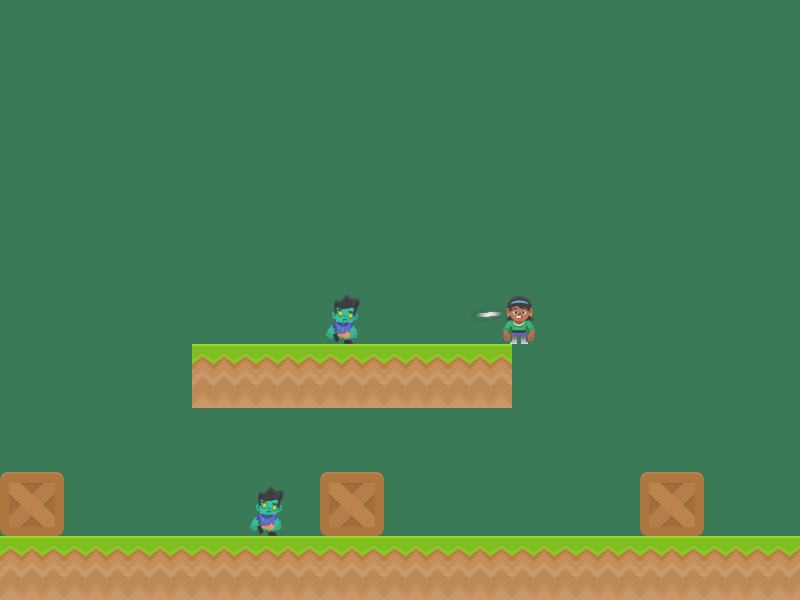
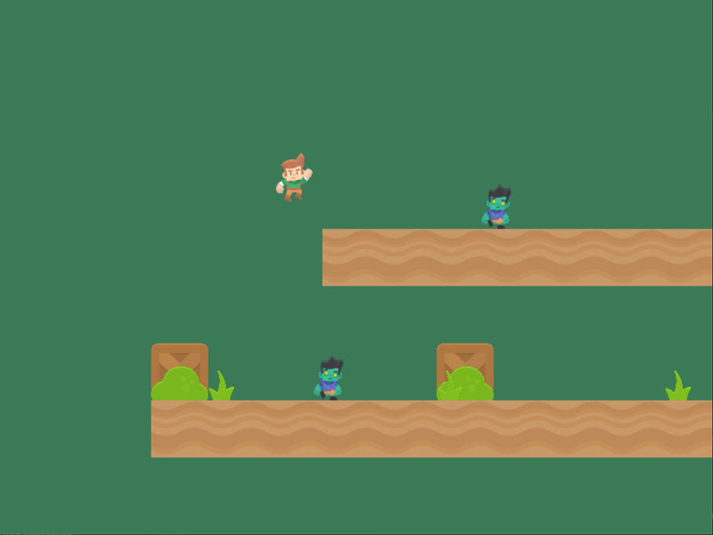
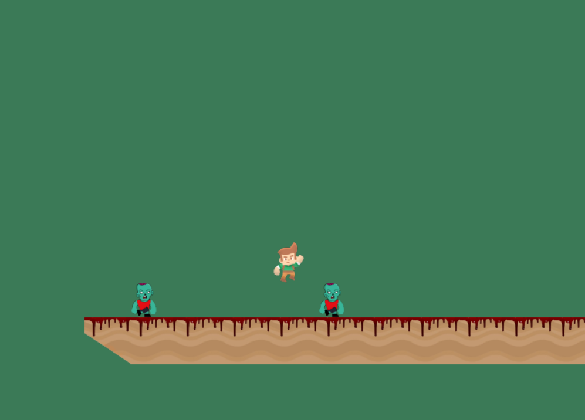

    

      
    

    

      

        <h4>Prototipo 0.1</h4>
      

      

        
Primera versión de nuestro juego

      

    

  

   

  

    

      
    

    

      

        <h4>Prototipo 0.2</h4>
      

      

        
Añadidas animaciones del jugador, distintos personajes, scroll del viewport, más plataformas, 

      

    

  

   
  
  

    

      
    

    

      

        <h4>Prototipo 0.3</h4>
      

      

        
Añadidas animaciones de los zombies con nuevos sprites, plataformas con borde y nuevos sprites

      

    

  
