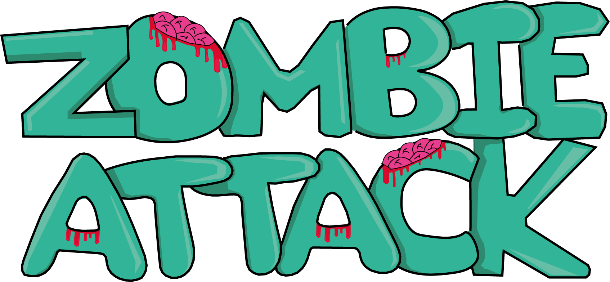

## Historia
El protagonista del juego debe tratar de salvar su vida en un ambiente de batalla en el que diferentes tipos de personajes buscarán derrotarlo.  
A medida que vayan pasando los niveles y vaya acabando con todos los zombies irá rescatando a la humanidad de este ataque. El objetivo del protagonista es llegar al último nivel en el que se acabar con la última onda de zombies.
Una vez hecho esto se habrá conseguido salvar a todos los miembros del juego, que podrá usar para jugar tras finalizar el juego.

  

    <a class="button button--primary button--rounded button--xl" href="https://github.com/uah-videojuegos-2021/final-project-grupo-1"><i class="fas fa-list"></i> REPOSITORIO</a>
  

  

    <a class="button button--primary button--rounded button--xl" href=""><i class="fas fa-clipboard-list"></i> GDD</a>
   

  

    <a class="button button--primary button--rounded button--xl" href=""><i class="fas fa-calendar-check"></i> MEMORIA</a>
  

